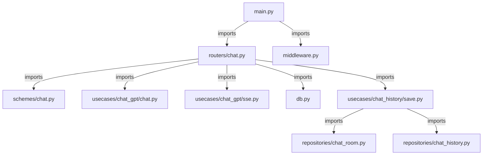

```mermaid
graph TD
    A[main.py] -->|imports| B[routers/chat.py]
    A -->|imports| C[middleware.py]
    B -->|imports| D[schemes/chat.py]
    B -->|imports| E[usecases/chat_gpt/chat.py]
    B -->|imports| F[usecases/chat_gpt/sse.py]
    B -->|imports| G[db.py]
    B -->|imports| H[usecases/chat_history/save.py]
    H -->|imports| I[repositories/chat_room.py]
    H -->|imports| J[repositories/chat_history.py]
```