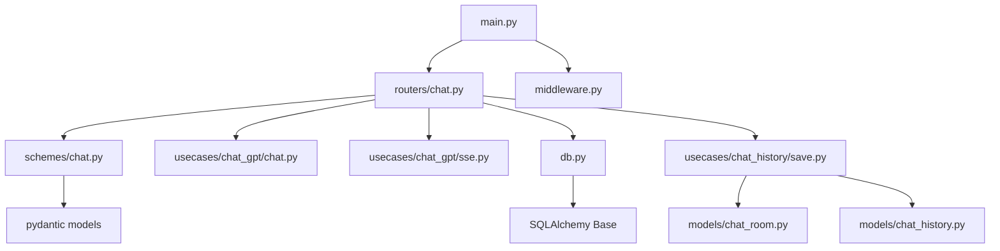

```mermaid
graph TD
    A[main.py] --> B[routers/chat.py]
    A --> C[middleware.py]
    
    B --> D[schemes/chat.py]
    B --> E[usecases/chat_gpt/chat.py]
    B --> F[usecases/chat_gpt/sse.py]
    B --> G[db.py]
    B --> H[usecases/chat_history/save.py]
    
    H --> I[models/chat_room.py]
    H --> J[models/chat_history.py]

    D --> K[pydantic models]
    G --> L[SQLAlchemy Base]
```