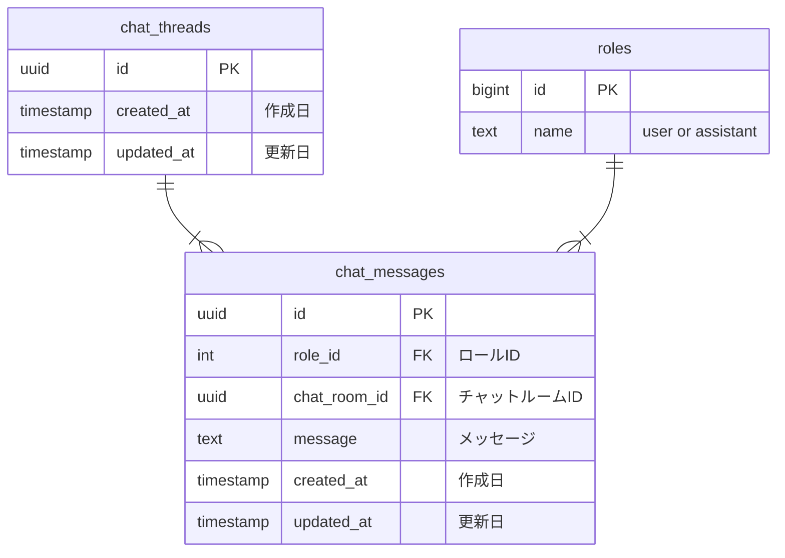

```mermaid
erDiagram

chat_threads ||--|{ chat_messages : ""
roles ||--|{ chat_messages : ""

roles {
  bigint id PK
  text name "user or assistant"
}

chat_messages {
  uuid id PK
  int role_id FK "ロールID"
  uuid chat_room_id FK "チャットルームID"
  text message "メッセージ"
  timestamp created_at "作成日"
  timestamp updated_at "更新日"
}

chat_threads {
  uuid id PK
  timestamp created_at "作成日"
  timestamp updated_at "更新日"
}

```