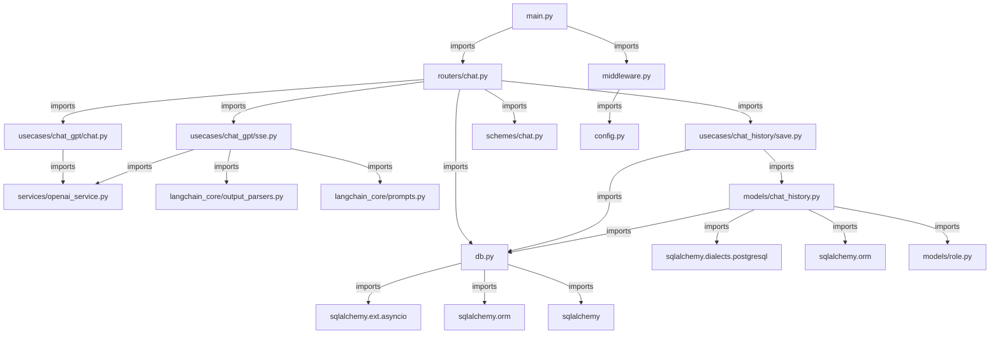

```mermaid
graph TD
    A[main.py] -->|imports| B[routers/chat.py]
    A -->|imports| C[middleware.py]
    B -->|imports| D[usecases/chat_gpt/chat.py]
    B -->|imports| E[usecases/chat_gpt/sse.py]
    B -->|imports| F[usecases/chat_history/save.py]
    B -->|imports| G[schemes/chat.py]
    B -->|imports| H[db.py]
    D -->|imports| I[services/openai_service.py]
    E -->|imports| I[services/openai_service.py]
    E -->|imports| J[langchain_core/output_parsers.py]
    E -->|imports| K[langchain_core/prompts.py]
    F -->|imports| L[models/chat_history.py]
    F -->|imports| H[db.py]
    C -->|imports| M[config.py]
    H -->|imports| N[sqlalchemy.ext.asyncio]
    H -->|imports| O[sqlalchemy.orm]
    H -->|imports| P[sqlalchemy]
    L -->|imports| Q[sqlalchemy.dialects.postgresql]
    L -->|imports| R[sqlalchemy.orm]
    L -->|imports| H[db.py]
    L -->|imports| S[models/role.py]
```