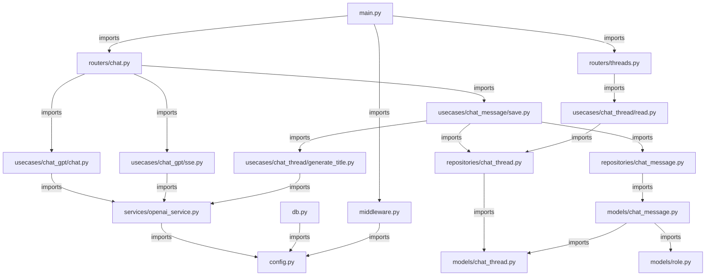

```mermaid
graph TB
    %% Main entry points
    main[main.py] -->|imports| routers/chat.py
    main[main.py] -->|imports| routers/threads.py
    main[main.py] -->|imports| middleware.py

    %% Routers
    routers/chat.py -->|imports| usecases/chat_gpt/chat.py
    routers/chat.py -->|imports| usecases/chat_gpt/sse.py
    routers/chat.py -->|imports| usecases/chat_message/save.py
    routers/threads.py -->|imports| usecases/chat_thread/read.py

    %% Usecases
    usecases/chat_gpt/chat.py -->|imports| services/openai_service.py
    usecases/chat_gpt/sse.py -->|imports| services/openai_service.py
    usecases/chat_message/save.py -->|imports| repositories/chat_thread.py
    usecases/chat_message/save.py -->|imports| repositories/chat_message.py
    usecases/chat_message/save.py -->|imports| usecases/chat_thread/generate_title.py
    usecases/chat_thread/read.py -->|imports| repositories/chat_thread.py
    usecases/chat_thread/generate_title.py -->|imports| services/openai_service.py

    %% Repositories
    repositories/chat_thread.py -->|imports| models/chat_thread.py
    repositories/chat_message.py -->|imports| models/chat_message.py

    %% Services
    services/openai_service.py -->|imports| config.py

    %% Database and Config
    db.py -->|imports| config.py
    models/chat_message.py -->|imports| models/role.py
    models/chat_message.py -->|imports| models/chat_thread.py

    %% Middleware
    middleware.py -->|imports| config.py
```