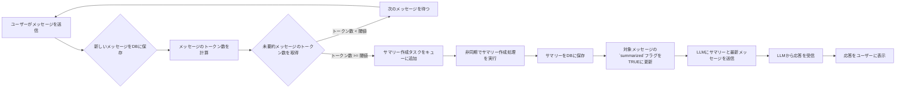

```mermaid
graph LR
    A[ユーザーがメッセージを送信] --> B{新しいメッセージをDBに保存};
    B --> C[メッセージのトークン数を計算];
    C --> D{未要約メッセージのトークン数を取得};
    D -- トークン数 < 閾値 --> E[次のメッセージを待つ];
    D -- トークン数 >= 閾値 --> F[サマリー作成タスクをキューに追加];
    F --> G[非同期でサマリー作成処理を実行];
    G --> H[サマリーをDBに保存];
    H --> I[対象メッセージの`summarized`フラグをTRUEに更新];
    I --> J[LLMにサマリーと最新メッセージを送信];
    J --> K[LLMから応答を受信];
    K --> L[応答をユーザーに表示];
    E --> A;
```